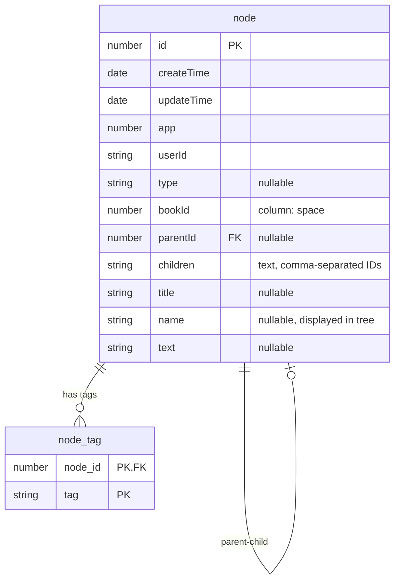

# Node Table Diagram

## Entity Relationship Diagram



## Table Structure Diagram

```
┌─────────────────────────────────────────────────────────────┐
│                         node table                          │
├─────────────────────────────────────────────────────────────┤
│  Primary Key:                                               │
│    • id (number)                                            │
│                                                             │
│  Timestamps:                                                │
│    • createTime (Date) - auto-set on creation              │
│    • updateTime (Date) - auto-updated on modification      │
│                                                             │
│  Relationships:                                             │
│    • app (number) - application identifier                 │
│    • userId (string) - owner of the node                   │
│    • bookId (number, column: 'space') - book/space ID      │
│    • parentId (number | null) - parent node reference      │
│                                                             │
│  Hierarchy:                                                 │
│    • children (number[] | null) - stored as TEXT           │
│      Format: "1,2,3" → [1,2,3] (transformed)               │
│                                                             │
│  Content:                                                   │
│    • type (string | null) - node type (always null)        │
│    • title (string | null) - title field                   │
│    • name (string | null) - display name (shown in tree)   │
│    • text (string | null) - node content                   │
└─────────────────────────────────────────────────────────────┘

                            │
                            │ 1:N
                            │ (CASCADE DELETE)
                            ▼
┌─────────────────────────────────────────────────────────────┐
│                      node_tag table                         │
├─────────────────────────────────────────────────────────────┤
│  Primary Key: (node_id, tag)                                │
│                                                             │
│  Columns:                                                   │
│    • node_id (number) - FK → node(id)                      │
│    • tag (string)                                           │
│                                                             │
│  Indexes:                                                   │
│    • idx_node_tag_tag                                       │
│    • idx_node_tag_node_id                                   │
└─────────────────────────────────────────────────────────────┘
```

## Hierarchical Structure Visualization

```
node (id=1, parentId=null, children="2,3,5")
├── node (id=2, parentId=1, children="4")
│   └── node (id=4, parentId=2, children=null)
├── node (id=3, parentId=1, children=null)
└── node (id=5, parentId=1, children=null)

    node_tag relationships:
    ├── node 1 → tags: ["important", "project"]
    ├── node 2 → tags: ["documentation"]
    └── node 4 → tags: ["draft"]
```

## Field Details Table

| Column Name | Database Type | TypeScript Type | Nullable | Description |
|-------------|---------------|-----------------|----------|-------------|
| id | number | number | No | Primary key, unique identifier |
| createTime | Date | Date | No | Auto-set on creation |
| updateTime | Date | Date | No | Auto-updated on modification |
| app | number | number | No | Application identifier |
| userId | string | string | No | Owner user ID |
| type | varchar | string | Yes | Node type (currently always null) |
| bookId | number | number | No | Book/space ID (column name: 'space') |
| parentId | integer | number | Yes | Parent node ID for hierarchy |
| children | text | number[] | Yes | Comma-separated child node IDs |
| title | varchar | string | Yes | Title field |
| name | varchar | string | Yes | Display name (shown in tree) |
| text | varchar | string | Yes | Node text content |

## Relationships

1. **Self-referential (Hierarchy)**
   - `parentId` → `node.id` (many-to-one)
   - `children` contains array of `node.id` values (one-to-many)

2. **node_tag (Many-to-Many Tags)**
   - `node_tag.node_id` → `node.id` (foreign key with CASCADE DELETE)
   - Composite primary key: (node_id, tag)
   - Indexed on both `tag` and `node_id` for efficient queries


